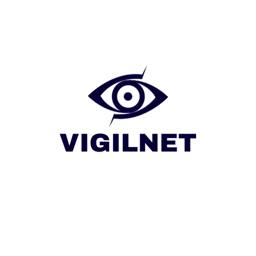
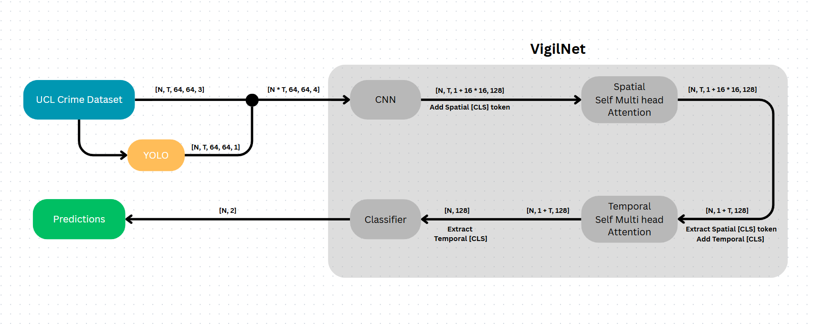

# VigilNet



VigilNet is an advanced AI system that leverages cutting-edge computer vision and deep learning techniques to enhance video surveillance. It is designed to analyze video feeds from surveillance cameras and provide real-time detection of various anomalies, including fights, robberies, and criminal activities.

**Current Status**: The model is actively in the training phase on the UCF Crime Dataset. Training results, performance metrics, and pre-trained model weights will be shared soon as training progresses and evaluation is completed.

## Table of Contents
- [Project Overview](#project-overview)
- [Repository Structure](#repository-structure)
- [Architecture](#architecture)
- [Explainability Power](#explainability-power)
- [Installation](#installation)
- [Usage](#usage)
- [Dataset](#dataset)
- [Training and Evaluation](#training-and-evaluation)
- [Future Work](#future-work)
- [Contributing](#contributing)
- [License](#license)
- [Contact](#contact)

## Project Overview
VigilNet aims to revolutionize video surveillance by automatically detecting anomalies in real-time. It processes video clips, identifies suspicious activities, and provides actionable insights for security personnel. The system integrates convolutional neural networks (CNNs) for feature extraction, YOLO for focusing on regions of interest (e.g., people), and attention mechanisms to capture spatial and temporal patterns in video data.

This repository contains the full source code, dataset handling scripts, and documentation for VigilNet. We are actively improving the model and will share updates as the project evolves.

## Repository Structure
- **`/dataset`**: Contains the `UCFVideoDataset` class for loading and preprocessing UCF video frames.
- **`/model`**: Includes the `VideoAnomalyDetector` class defining the neural network and the `create_yolo_masks` function for YOLO-based masks.
- **`/main.py`**: The main script for training the model and visualizing attention maps.
- **`/doc`**: Contains images used in the documentation:
  - `logo.png`: The VigilNet logo.
  - `flowchart.png`: A visual representation of the VigilNet architecture.
- **`/README.md`**: This documentation file.
- **`/requirements.txt`**: List of required Python packages.

## Architecture
VigilNet’s architecture combines CNNs and attention mechanisms to process video clips and detect anomalies effectively. Here’s a breakdown of its components:

### 1. Input Processing
- **Input Shape**: `[batch, T, 4, H, W]`, where:
  - `batch`: Batch size (e.g., 64).
  - `T`: Number of frames per clip (default 16).
  - `4`: Channels (RGB + mask).
  - `H, W`: Frame height and width (default 64x64 or 256x256).
- **YOLO Integration**: A pre-trained YOLOv5s model generates binary masks for objects of interest (e.g., persons) in each frame, enhancing focus on relevant areas.

### 2. CNN Feature Extraction
- **Convolutional Layers**: Extract spatial features from each frame using multiple convolutional and pooling layers.
- **Output**: Feature maps capturing spatial details, reduced in size for efficiency.

### 3. Spatial Attention Mechanism
- **Process**: Highlights critical regions within each frame (e.g., a person involved in an anomaly) using multi-head attention.
- **Output**: Summarized spatial context per frame.

### 4. Temporal Attention Mechanism
- **Process**: Analyzes relationships across frames to understand the sequence of events.
- **Output**: A temporal summary capturing the progression of anomalies.

### 5. Classification
- **Layer**: A linear layer maps features to binary logits (normal vs. anomalous).
- **Output**: Classification scores with attention weights for explainability.

### Flowchart
The flowchart below provides a visual representation of the VigilNet architecture:



**Simple Explanation of the Flowchart**:  
The flowchart shows how VigilNet processes video data step-by-step:
- **Starting Point**: It begins with video clips from the UCF Crime Dataset.
- **YOLO Step**: The YOLO model identifies and creates masks for important objects (like people) in each frame.
- **CNN Step**: Convolutional Neural Networks (CNNs) analyze each frame to pull out key visual features, like shapes or movements.
- **Attention Mechanisms**: 
  - **Spatial Attention**: Focuses on the most important parts within each frame (e.g., where an anomaly might be happening).
  - **Temporal Attention**: Looks at how these parts change across multiple frames to spot patterns over time.
- **Final Prediction**: The system combines all this information to decide if the video shows a normal scene or an anomaly (like a fight or robbery).

This flow helps VigilNet understand and classify what’s happening in the video by breaking it down into manageable steps.

## Explainability Power
VigilNet’s explainability is a key feature, achieved through attention mechanisms that reveal decision-making processes:

### Spatial Attention
- **What It Does**: Highlights key regions within each frame (e.g., a suspicious movement).
- **Visualization**: Heatmaps showing focus areas, generated from attention weights.

### Temporal Attention
- **What It Does**: Identifies key frames contributing to the anomaly classification.
- **Visualization**: Graphs or matrices showing the temporal progression of events.

### YOLO Integration
- **Role**: Focuses attention on detectable objects (e.g., people), grounding the model’s reasoning.

This explainability enhances trust and usability, making VigilNet practical for real-world security applications.

## Installation
Follow these steps to set up VigilNet locally:

1. **Clone the Repository**:
   ```bash
   git clone https://github.com/yourusername/VigilNet.git
   cd VigilNet
   ```

2. **Install Dependencies**:
   - Ensure Python 3.8+ and PyTorch are installed.
   - Install required packages:
     ```bash
     pip install torch torchvision torchaudio
     pip install ultralytics  # For YOLOv5
     pip install matplotlib tqdm numpy pillow
     ```

3. **Download the Dataset**:
   - Place the UCF Crime Dataset in `archive/` (e.g., `archive/Train` and `archive/Test`).

4. **Set Up GPU (Optional)**:
   - Requires a CUDA-compatible NVIDIA GPU for faster training.

## Usage
Run VigilNet with these commands:

- **Training**:
  ```bash
  python main.py --train True
  ```
  - Trains the model and saves weights to `anomaly_detector.pth`.

- **Inference and Visualization**:
  ```bash
  python main.py --train False
  ```
  - Loads the model and visualizes attention for a test batch.

## Dataset
VigilNet uses the **UCF Crime Dataset**:
- **Structure**: Training and testing clips labeled as normal or anomalous (e.g., Abuse, Arson).
- **Processing**: Clips are processed into 16-frame sequences with binary labels.

## Training and Evaluation
- **Status**: Currently training with the Adam optimizer and CrossEntropyLoss.
- **Upcoming**: Metrics (accuracy, precision, recall, F1-score) and visualizations will be shared post-training.

## Future Work
- Optimize for real-time inference on edge devices.
- Expand the dataset with more anomaly types.
- Enhance explainability with additional visualization techniques.
- Deploy as a practical surveillance tool.

## Contributing
Contributions are welcome! To contribute:
1. Fork the repository.
2. Create a branch (`git checkout -b feature-branch`).
3. Commit changes (`git commit -m "Add feature"`).
4. Push (`git push origin feature-branch`).
5. Submit a Pull Request.

## License
This project is licensed under the MIT License. See `LICENSE` for details.

## Contact
For inquiries or collaboration:
- **Author**: Ayyoub JAICHI
- **Email**: ayyoub.jaichi@gmail.com
- **GitHub**: [ayyoubjai](https://github.com/ayyoubjai)

